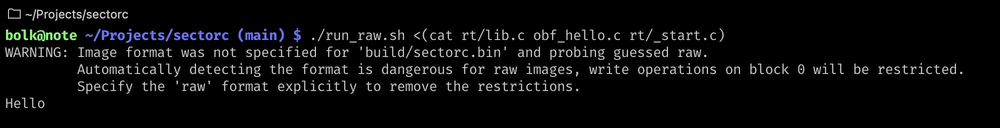

# Обфускация кода программ на SectorC

Подробности есть [у меня в блоге](https://bolknote.ru/all/sectorcfuck/).

- start.sh — файл, запускающий обфусцированный код
- obf_hello.c — обфусцированная программа, выводящая «Hello»
- check_collision.c — программа для поиска коллизий

